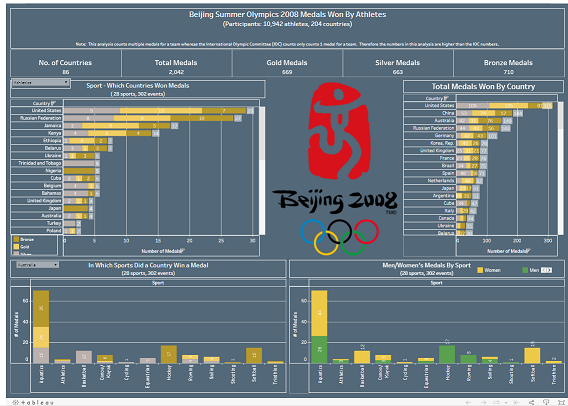
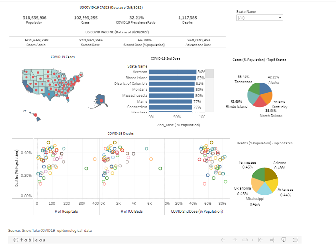
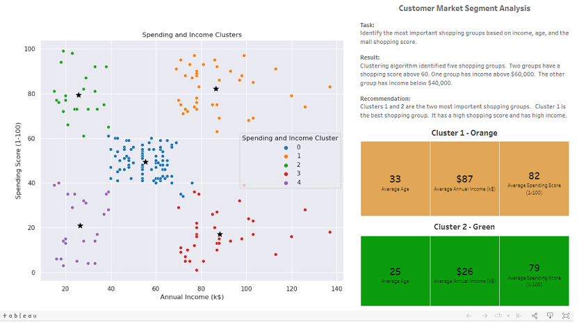
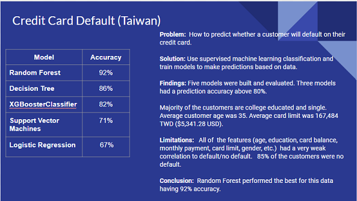
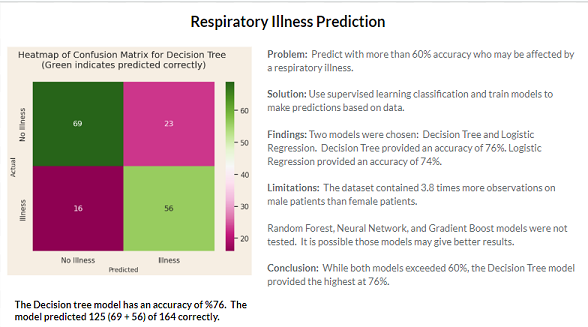

## [Project 1: Beijing Olympics Summer 2008](https://github.com/Sarah269/Olympics-Data-Exploration?tab=readme-ov-file)

This project analyzes the medals earned at the Summer 2008 Beijing Olympics.  The data sources for the project are Oracle Live SQL Olympics Medals view and World Population table, and https://populationpyramid.net.  Oracle Live SQL, SAS Studio, and Tableau were used in this project. 

This analysis counts multiple medals for a team whereas the International Olympic Committee (IOC) counts only counts 1 medal for a team. Therefore the numbers in this analysis are higher than the IOC numbers.

## [Project 2: COVID-19 in the United States](https://github.com/Sarah269/Data-Cleaning-COVID19)
This project analyzes the impact of COVID-19 on the 50 states. The data source was a Snowflake covid19_epidemiological_data database consisting of many tables. The tables were reviewed, and four tables were selected for this analysis. The data from the tables was aggregated, and new features were created.

## Project 3:  Customer Segmentation Clustering
This project analyzes data collected on customer behavior to identify which groups to target for a marketing campaign. Using the clustering unsupervised machine learning method with the k-means algorithm, five groups were identified from the data. The mall shopping score and income features were compared. One group was identified as having a high mall shopping score and a high income. The marketing campaign should target this group.

## Project 4: Credit Card Default Classification
This project looks at customer credit card data for Taiwan. The customers are classified as default or no default. Five machine learning classification models were built and evaluated to determine which was the best model to predict customer default.

## Project 5: Diabetes Progression Linear Regression
This project looks at data on respiratory illnesses in patients. The patients are classified as having an illness or no illness. Two machine learning classification models were built and evaluated to determine which was the best model to predict patient illness.

