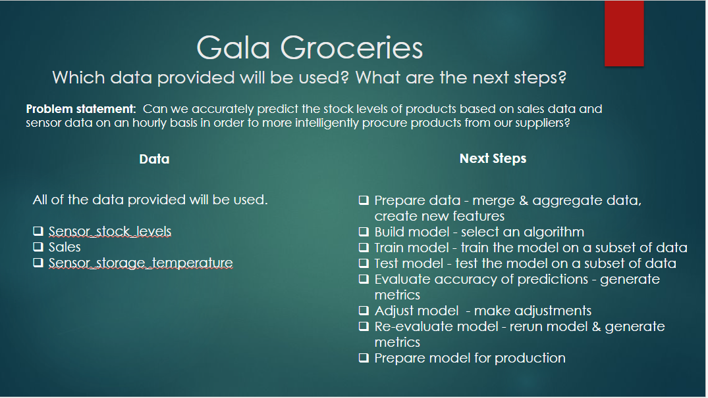
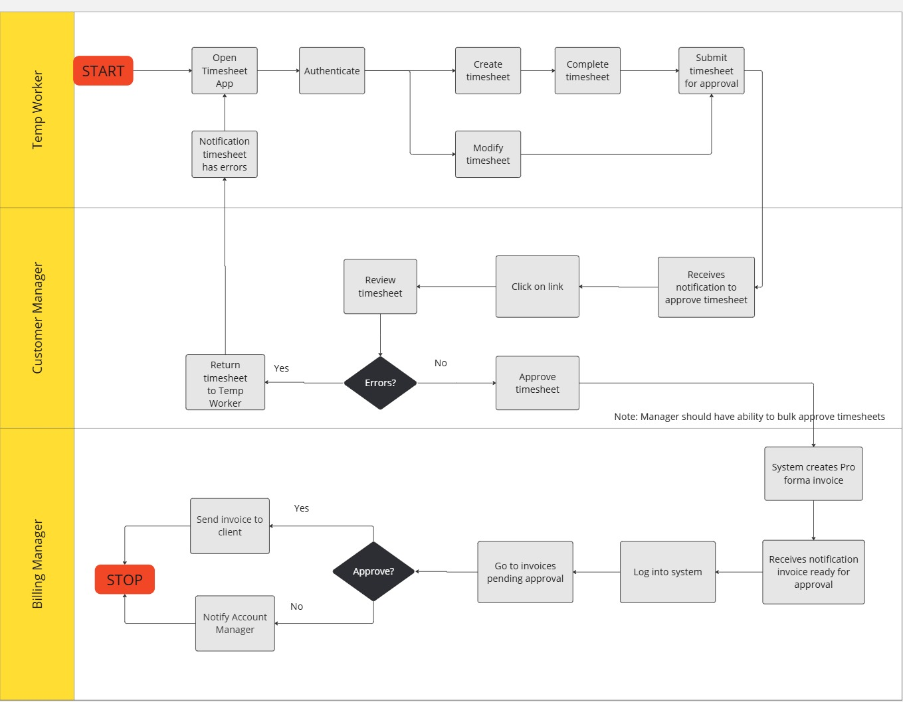
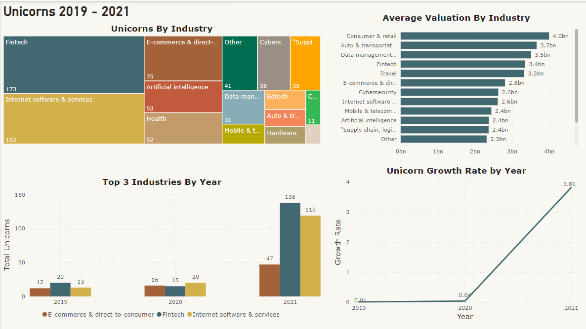
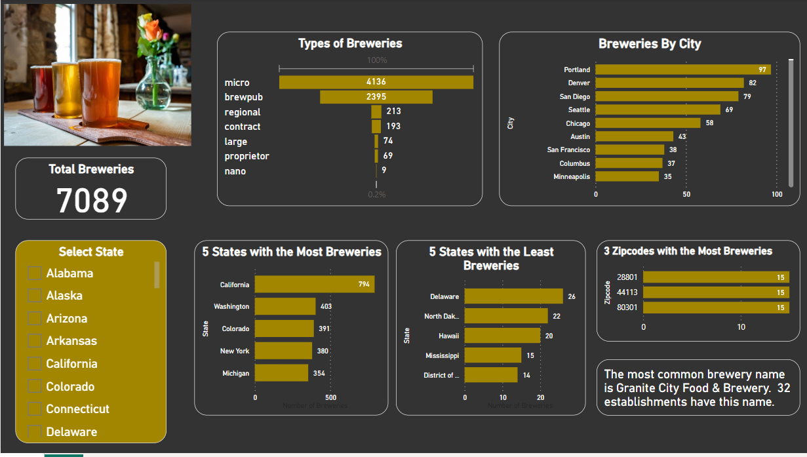

## [Virtual Job Experience on Forage](https://github.com/Sarah269/bug-free-eureka/tree/main)

Completed job simulations based on the work of an actual role at a company.

 

# Projects

## [Analyzing Unicorn Companies](https://github.com/Sarah269/glowing-dollop/tree/main/Unicorn%20Companies)
Determined the top three industries that had most unicorn companies for the period 2019 - 2021.  PostgreSQL and Power BI were used in the project.

## [Evaluate Manufacturing Process](https://github.com/Sarah269/glowing-dollop/tree/main/Manufacturing%20Process)

Analyzed historical manufacturing data to define the acceptable range for height measurements and identified any points in the process that fell outside of the range.  PostgreSQL and Power BI were used in this project.

## [Bike Sales](https://github.com/Sarah269/glowing-dollop/tree/main/Bike%20Sales)

This project analyzes customer data to provide insights on who is purchasing bikes.  The data source for this project was AlextheAnalyst's bike sales dataset.  Excel was used to perform the analysis.

## [COVID-19 in the United States](https://github.com/Sarah269/Data-Cleaning-COVID19)

This project analyzed the impact of COVID-19 on the 50 states. The data source was a Snowflake covid19_epidemiological_data database consisting of many tables. The tables were reviewed, and four tables were selected for this analysis. The data from the tables was aggregated, and new features were created. Snowflake, SQL, and Tableau were used in this project.

## [Beijing Olympics Summer 2008](https://github.com/Sarah269/Olympics-Data-Exploration?tab=readme-ov-file)

This project analyzes the medals earned at the Summer 2008 Beijing Olympics.  The data sources used in this project were Oracle Live SQL Olympics Medals view and World Population table, and https://populationpyramid.net.  Oracle Live SQL, SAS Studio, and Tableau were used in this project. 

This analysis counts multiple medals for a team whereas the International Olympic Committee (IOC) counts only counts 1 medal for a team. Therefore the numbers in this analysis are higher than the IOC numbers.

## [Breweries in the United States](https://github.com/Sarah269/glowing-dollop/tree/main/Breweries)

This project analyzes data obtained from the Open Brewery database public API to gain insights on breweries located in the United States.  Python and PowerBI were used in this project. 

[FindaBrewery web application](https://probable-octo-robot-cm4nr6wt7yvnusynumfme2.streamlit.app/)

